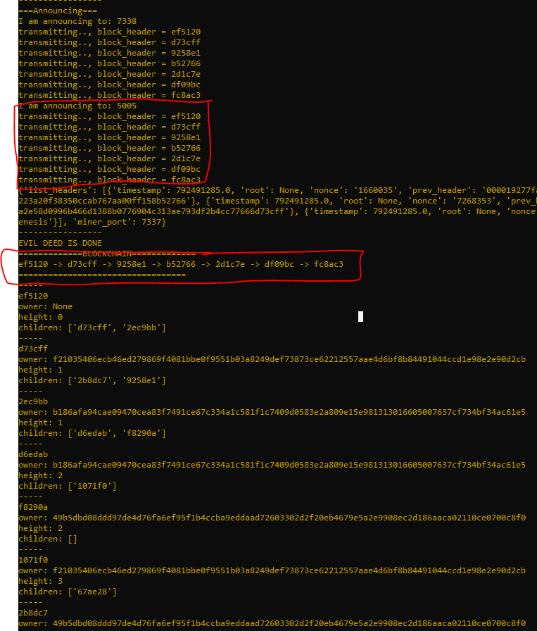

# 50.037 Blockchain Project
This project aims to simulate blockchain circulation in a small scale. On top of normal blockchain minings and transactions, it also supports simulation of Selfish Mining Attack and 51% Attack (Majority attack)

## Getting Started
--- 
### Prerequisite
- Assumption only one Python version 3.7 installed in the computer
### Installation
- Clone the project
- On the root folder, run `.\blockchain\Scripts\activate` on bash terminal
- run `python -m pip install -r requirements.txt`

## Usage Methods
--- 
## Blockchain environment
### Initalization
We simulate normal blockchain environment with 2 different miners and 1 SPV client.  
In 3 different terminals, run the following codes:
```
python MinerApp.py -p 5004 -s normal
```
```
python MinerApp.py -p 5005 -s normal
```
```
python SPVApp.py
```
Open another terminal to run the control script
```
python Postman.py -m 1
```

### Selfish Mining Attack
We simulate the selfish mining attack with 2 different miners and 1 SPV client. 1 miner will act as a normal miner and the other miner will be the selfish miner.  
In 3 different terminals, run the following codes:
```
python MinerApp.py -p 5004 -s selfish
```
```
python MinerApp.py -p 5005 -s selfish
```
```
python SPVApp.py
```
Open another terminal to run the control script
```
python Postman.py -m 3
```

### 51% Attack (Majority Attack)
We simulate the 51% mining attack with 3 different miners and 1 SPV client. 1 miner will act as a normal miner and the other 2 miners will act as the malicious miners.  
In 4 different terminals, run the following codes:
```
python MinerApp.py -p 7337 -s 51
```
```
python MinerApp.py -p 7338 -s 51
```
```
python MinerApp.py -p 5005 -s 51
```
```
python SPVApp.py
```
Open another terminal to run the control script
```
python Postman.py -m 4
```


---

Refer to [Writeup.pdf](./Writeup.pdf) for more information

## Authors
- Andre Hadianto Lesmana (1002837)
- Antonio Miguel Canlas Quizon (1003014)
- Kenneth Ng (1002793)
- Teo Yong Quan (1002828)